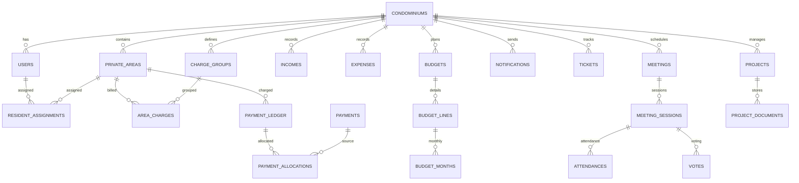

# Entity Relationship - estado actual e inferido

## 1) Mapa actual (FK declaradas en MySQL)

```mermaid
erDiagram
  AREAS_PRIVATIVAS ||--o{ AREAS_PRIVATIVAS_HAS_CUOTAS : has
  CAT_GRUPOS_COBRO ||--o{ AREAS_PRIVATIVAS_HAS_CUOTAS : belongs_to

  AREAS_PRIVATIVAS ||--o{ AREAS_PRIVATIVAS_IMAGENES : has
  AREAS_PRIVATIVAS ||--o{ ARRENDAMIENTOS : has

  CAT_GRUPOS_COBRO ||--o{ CAT_GRUPOS_COBRO_HISTORICO : tracks

  CAT_TIPOS_CONVOCATORIAS ||--o{ CAT_SUBTIPOS_CONVOCATORIAS : has

  CONVOCATORIAS_FECHAS ||--o{ ASISTENCIAS_CONVOCATORIA : has
  AREAS_PRIVATIVAS ||--o{ ASISTENCIAS_CONVOCATORIA : attends

  DCAT_CATEGORIAS_COMERCIAL ||--o{ DCAT_SUBCATEGORIAS_COMERCIAL : has

  DIRECTORIO ||--o{ DIRECTORIO_HAS_ASIGNACIONES : has
  ROLES_CONDOMINAL ||--o{ DIRECTORIO_HAS_ASIGNACIONES : role

  HISTORICO_PAGOS ||--o{ HISTORICO_PAGOS_HAS_PAGOS : allocates
  HISTORICO_PAGOS_DETALLE ||--o{ HISTORICO_PAGOS_HAS_PAGOS : detail

  CAT_MODULOS ||--o{ ROLES_CONDOMINAL_HAS_CAT_MODULOS : assigned
  ROLES_CONDOMINAL ||--o{ ROLES_CONDOMINAL_HAS_CAT_MODULOS : role
```

Observaciones:
- Existen 39 columnas con FK declarada.
- Existen 167 columnas id_* sin FK declarada (alto porcentaje de relaciones implicitas).

## 2) Relaciones implicitas reconstruidas (para migracion)

Relaciones candidatas prioritarias a materializar:

- PAGOS.id_areas_privativas -> AREAS_PRIVATIVAS.id_areas_privativas
- PAGOS.id_cat_grupos_cobro -> CAT_GRUPOS_COBRO.id_cat_grupos_cobro
- HISTORICO_PAGOS.id_arrendamientos -> ARRENDAMIENTOS.id_arrendamientos
- HISTORICO_PAGOS_DETALLE.id_cat_grupos_cobro -> CAT_GRUPOS_COBRO.id_cat_grupos_cobro
- DIRECTORIO.id_roles_condominal -> ROLES_CONDOMINAL.id_roles_condominal
- DIRECTORIO_HAS_CAT_PUESTOS.id_cat_puestos -> CAT_PUESTOS.id_cat_puestos
- CONVOCATORIAS.id_cat_tipos_convocatoria -> CAT_TIPOS_CONVOCATORIAS.id_cat_tipos_convocatoria
- CONVOCATORIAS.id_cat_subtipos_convocatorias -> CAT_SUBTIPOS_CONVOCATORIAS.id_cat_subtipos_convocatorias
- CONVOCATORIAS.id_directorioConvoca -> DIRECTORIO.id_directorio
- CONVOCATORIAS.id_directorioModerador -> DIRECTORIO.id_directorio
- CONVOCATORIAS_FECHAS.id_convocatorias -> CONVOCATORIAS.id_convocatorias
- TICKETS.id_directorio -> DIRECTORIO.id_directorio
- TICKETS.id_areas_privativas -> AREAS_PRIVATIVAS.id_areas_privativas
- NOTIFICACIONES.id_directorio -> DIRECTORIO.id_directorio
- GASTOS.id_cat_conceptos_presupuesto -> CAT_CONCEPTOS_PRESUPUESTO.id_cat_conceptos_presupuesto
- INGRESOS.id_cat_formas_pago -> CAT_FORMAS_PAGO.id_cat_formas_pago

## 3) ERD objetivo simplificado (nuevo modelo)

## 4) Riesgos relacionales actuales

1. Integridad referencial incompleta (FK faltantes).
2. Tablas backup sin PK dentro del mismo schema productivo.
3. Entidades financieras criticas (pagos/historicos) con acoplamiento por nombres en lugar de constraints.
4. Muchas relaciones N:N sin estandar de auditoria ni claves unicas compuestas.

## 5) Regla de migracion para relaciones

Durante la migracion a PostgreSQL:

1. Crear tablas destino con FK estrictas y ON DELETE/UPDATE definidos.
2. Migrar catalogos primero.
3. Migrar maestros (usuarios, areas, roles).
4. Migrar transaccionales (charges, ledger, payments, allocations).
5. Activar constraints diferidas durante carga masiva y validar al cierre.
